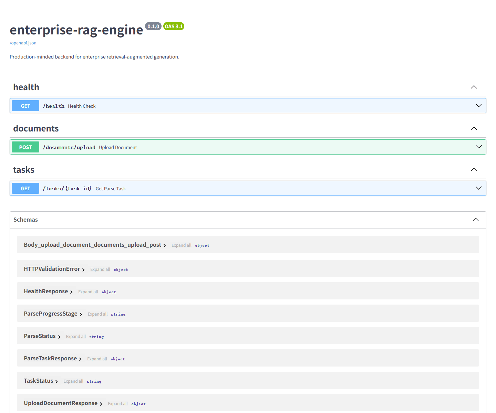
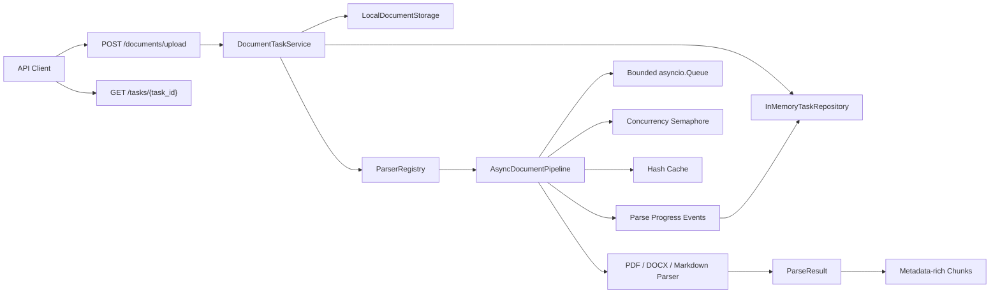

# Enterprise RAG Engine

面向企业知识库场景的 RAG 后端工程。当前版本聚焦可评测的文档摄取管道，已经具备多格式解析、结构保留、分块、异步并发、背压、内容缓存、任务进度与 FastAPI 上传接口。

## 中文简介

`enterprise-rag-engine` 是一个面向企业级 RAG 的 Python 后端项目。它不是简单的
RAG Demo，而是围绕文档解析、分块、混合检索、重排、引用溯源、自动化评测、
流式 API、多租户边界和可观测性逐步构建的工程化作品。

The goal is not to build a toy RAG demo, but to provide a maintainable backend foundation
for document pipelines, chunking, hybrid retrieval, reranking, citations, evaluations,
streaming APIs, multi-tenant controls, and observability.

## Current Milestone

| Item | Status |
|---|---|
| Milestone | W4 document pipeline completed |
| Release candidate | `rag-v0.4.0` |
| Automated tests | 86 passing |
| Coverage | 89.16% |
| Next focus | Qdrant, embedding and metadata-filtered retrieval |

## Highlights

- PDF、DOCX、Markdown 基础解析，并保留页码、标题路径和 content hash
- Docling 结构化 PDF 可选适配器、表格统一表示和 OCR Provider 抽象
- Recursive、Parent-Child、Semantic 三种分块策略及质量评测
- 基于 `asyncio.Queue` 和 `Semaphore` 的有界并发与背压
- 文件 hash 缓存，内容未变化时跳过重复解析
- `queued`、`started`、`cache_hit`、`succeeded`、`failed` 进度事件
- 文档上传、后台解析和 task_id 状态查询 API
- `ruff`、`mypy strict`、`pytest`、`pytest-cov` 工程门禁



[查看 API 静态截图](docs/assets/api-docs.png)

## Architecture



## Pipeline Benchmark

运行环境：Windows、Python 3.12；使用确定性模拟阻塞解析器，20 个文件，每文件 64 KiB，单次解析延迟 50 ms，并发上限 4，队列容量 8。延迟从任务进入 bounded queue 开始，到终态事件结束，包含排队和并发等待。

| Metric | Result |
|---|---:|
| Files | 20 |
| Succeeded / Failed | 20 / 0 |
| Observed max concurrency | 4 |
| Total elapsed | 266.301 ms |
| Throughput | 75.103 files/s |
| P50 latency | 154.056 ms |
| P95 latency | 202.779 ms |
| Max latency | 204.060 ms |
| Peak traced Python memory | 0.148 MiB |

复现压测：

```powershell
python scripts/pipeline_benchmark.py
```

自定义参数：

```powershell
python scripts/pipeline_benchmark.py `
  --files 20 `
  --concurrency 4 `
  --queue-size 8 `
  --parser-delay-ms 50 `
  --payload-kb 64
```

该 benchmark 评估的是管道调度、背压和内存基线，不等同于真实 PDF、OCR 或 Docling 性能。真实解析性能取决于文档页数、版式、扫描质量、解析器和机器配置。

## Chunk Quality Baseline

| Strategy | Chunks | Avg chars | P95 chars | Overlap | Context complete |
|---|---:|---:|---:|---:|---:|
| Recursive | 5 | 147.2 | 180.0 | 0.115489 | 1.0 |
| Parent-Child | 13 | 122.0 | 270.0 | 0.588272 | 1.0 |
| Semantic | 7 | 92.0 | 148.0 | 0.0 | 1.0 |

复现分块评测：

```powershell
python scripts/chunk_eval.py
```

## API

启动服务：

```powershell
uvicorn enterprise_rag_engine.api.app:app --reload
```

打开 Swagger UI：`http://127.0.0.1:8000/docs`

| Method | Path | Description |
|---|---|---|
| `GET` | `/health` | 服务健康检查 |
| `POST` | `/documents/upload` | 上传 PDF、DOCX 或 Markdown，返回 `202` 和 task_id |
| `GET` | `/tasks/{task_id}` | 查询任务进度、解析状态、耗时、chunk 数和错误 |
| `GET` | `/docs` | Swagger UI |
| `GET` | `/openapi.json` | OpenAPI schema |

PowerShell 上传示例：

```powershell
curl.exe -X POST "http://127.0.0.1:8000/documents/upload" `
  -F "file=@README.md;type=text/markdown"
```

响应示例：

```json
{
  "task_id": "b1163a29-ecb9-42dd-97af-43187aca0dfa",
  "filename": "README.md",
  "status": "queued",
  "task_url": "http://127.0.0.1:8000/tasks/b1163a29-ecb9-42dd-97af-43187aca0dfa"
}
```

## Document Pipeline

| Component | Purpose | Preserved information |
|---|---|---|
| `PdfTextParser` | PDF 页级文本抽取 | page、source URI、content hash |
| `MarkdownParser` | Markdown 结构解析 | heading-based `section_path` |
| `DocxParser` | Word 文档解析 | Heading style `section_path` |
| `StructuredPdfParser` | Docling 可选适配器 | Markdown 和表格布局 |
| `OcrDocumentParser` | OCR 结果标准化 | page、confidence、errors |
| `RecursiveSplitter` | 通用递归分块 | offset、token count、overlap |
| `ParentChildSplitter` | 小块召回、大块生成 | parent-child relationship |
| `SemanticSplitter` | 相邻语义单元聚合 | semantic boundaries、offset |
| `AsyncDocumentPipeline` | 异步批量解析 | bounded queue、concurrency、events |

## Project Layout

```text
enterprise-rag-engine/
├── datasets/                  # Parser golden dataset
├── docs/adr/                  # Architecture decisions
├── scripts/                   # Reproducible eval and benchmark CLIs
├── src/enterprise_rag_engine/
│   ├── api/                   # FastAPI routers, services and repositories
│   ├── document_pipeline/     # Parsers, splitters, cache and async pipeline
│   └── evals/                 # Parser, chunk and pipeline evaluation
├── tests/
├── LICENSE
├── pyproject.toml
└── README.md
```

## Development

项目使用 Python 3.11+。安装开发依赖：

```powershell
python -m pip install -e ".[dev]"
```

运行质量门禁：

```powershell
$env:RUFF_CACHE_DIR="D:\code\codex_learn\.tool-cache\ruff"
$env:COVERAGE_FILE="D:\code\codex_learn\.tool-cache\coverage\.coverage.enterprise-rag-engine"
ruff check .
mypy --cache-dir "D:\code\codex_learn\.tool-cache\mypy" src tests scripts
pytest -p no:cacheprovider
```

## Configuration

| Variable | Default | Description |
|---|---|---|
| `APP_NAME` | `enterprise-rag-engine` | 服务名称 |
| `APP_ENV` | `dev` | `dev`、`test` 或 `prod` |
| `APP_VERSION` | `0.1.0` | API 版本 |
| `LOG_LEVEL` | `INFO` | Python 日志级别 |
| `UPLOAD_DIR` | `.data/uploads` | 本地上传文件目录 |
| `MAX_UPLOAD_BYTES` | `20971520` | 单文件最大字节数，默认 20 MiB |

## Current Boundaries

- FastAPI `BackgroundTasks` 和内存任务仓储适合单进程开发环境，不提供任务持久化。
- 本地文件存储尚未接入对象存储、病毒扫描和 magic bytes 校验。
- 当前 benchmark 使用确定性模拟解析器，真实文档 benchmark 将随 Golden Dataset 扩充。
- 向量索引、Hybrid Search、Rerank、Citation 和生成评测将在后续里程碑实现。

## License

MIT
