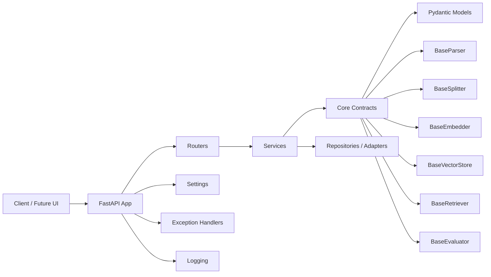

# Enterprise RAG Engine

Enterprise RAG Engine is a Python backend project for building production-minded
retrieval-augmented generation systems.

## 中文简介

`enterprise-rag-engine` 是一个面向企业级 RAG 的 Python 后端项目。它不是简单的
RAG Demo，而是围绕文档解析、分块、混合检索、重排、引用溯源、自动化评测、
流式 API、多租户边界和可观测性逐步构建的工程化作品。

当前阶段已经完成 W1 工程基线：`src layout`、质量门禁、核心数据模型、ABC 组件
契约、FastAPI 基础结构、配置、日志和统一异常响应。后续将进入 PDF 文本解析和文档
管道建设。

This repository is part of a 24-week LLM application engineering learning plan. The goal
is not to build a toy RAG demo, but to gradually implement a system with document
pipelines, chunking, hybrid retrieval, reranking, citations, evaluations, streaming APIs,
multi-tenant controls, and observability.

## Current Milestone

- Stage: W1 completed
- Focus: engineering baseline, core contracts, FastAPI scaffold, configuration, logging, errors
- Status: ready for W2 document parsing work

## W1 Results

| Area | Result |
|---|---|
| Package layout | `src layout` with editable install support |
| Quality gates | `ruff`, `mypy strict`, `pytest`, `pytest-cov`, `pre-commit` |
| Core models | `Document`, `DocumentChunk`, `ChunkMetadata`, `ParseResult`, `RetrievalResult` |
| Component contracts | ABC-based parser, splitter, embedder, vector store, retriever, evaluator contracts |
| API scaffold | FastAPI app factory and `/health` endpoint |
| Runtime basics | Settings, `.env.example`, logging configuration, standard error responses |
| Verification | 12 tests passing, coverage above 95% |

## Planned Capabilities

- Document parsing pipeline
- Metadata-preserving chunking
- Dense, sparse, and hybrid retrieval
- Reranking
- Citation-aware answer generation
- Retrieval and generation evaluations
- FastAPI service layer
- Streaming responses
- Multi-tenant access boundaries
- Observability and deployment documentation

## Project Layout

```text
enterprise-rag-engine/
├── docs/
│   ├── adr/
│   └── reports/
├── datasets/
├── scripts/
├── src/
│   └── enterprise_rag_engine/
├── tests/
├── LICENSE
├── pyproject.toml
└── README.md
```

## Architecture



## Engineering Baseline

This project starts with a strict engineering baseline:

- `src layout` for clean packaging boundaries
- `ruff` for linting and import sorting
- `mypy strict` for type checking
- `pytest` for automated tests
- `pytest-cov` for coverage reporting
- MIT license for open-source friendliness

## Development

Create and activate a virtual environment:

```powershell
python -m venv .venv
.\.venv\Scripts\Activate.ps1
```

Install development dependencies:

```powershell
python -m pip install -e ".[dev]"
```

Run quality checks:

```powershell
$env:RUFF_CACHE_DIR="D:\code\codex_learn\.tool-cache\ruff"
$env:COVERAGE_FILE="D:\code\codex_learn\.tool-cache\coverage\.coverage.enterprise-rag-engine"
ruff check .
mypy --cache-dir "D:\code\codex_learn\.tool-cache\mypy" src tests
pytest -p no:cacheprovider
```

Install pre-commit hooks:

```powershell
pre-commit install
pre-commit run --all-files
```

## API

Run the development server:

```powershell
uvicorn enterprise_rag_engine.api.app:app --reload
```

Available endpoints:

| Method | Path | Description |
|---|---|---|
| GET | `/health` | Service health check |
| GET | `/docs` | Swagger UI generated from OpenAPI |
| GET | `/openapi.json` | OpenAPI schema |

## Configuration

Copy `.env.example` to `.env` for local overrides:

```powershell
Copy-Item .env.example .env
```

Supported settings:

| Variable | Default | Description |
|---|---|---|
| `APP_NAME` | `enterprise-rag-engine` | Service name used in API metadata and health checks |
| `APP_ENV` | `dev` | Runtime environment: `dev`, `test`, or `prod` |
| `APP_VERSION` | `0.1.0` | Service version |
| `LOG_LEVEL` | `INFO` | Python logging level |

## Learning Notes

Each major design decision will be recorded in `docs/adr/`.
Each benchmark or evaluation report will be recorded in `docs/reports/`.
